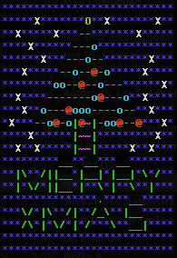
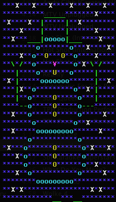

# JChristmas
Console-Based Java Application That Outputs Festive ASCII Art From A File

Navigate into the working directory
> cd JChristmas

Application is pre-compiled, simply run the following
> java Christmas

To recompile and then run, type the following
> javac Christmas.java

> java Christmas

ASCII output

To edit the text output, open the "block.x2g" file in a text editor

